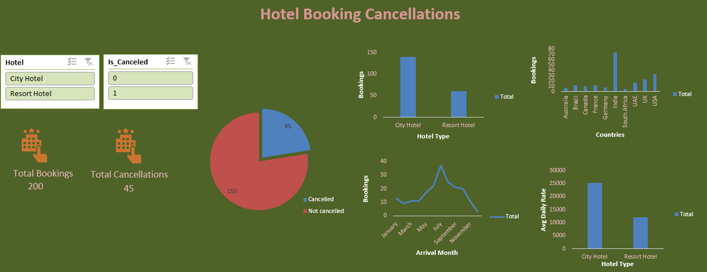

# Excel Dashboard Project

## Overview
This project is an interactive Excel dashboard created to analyze hotel booking data, cancellations, and revenue trends.

## Charts Explanation
* Bookings by Hotel Type: Compares bookings between City Hotel and Resort Hotel
* Bookings by Country: Shows which countries generate more bookings
* Monthly Booking Trend: Displays booking patterns across different months
* Cancellation Analysis (Pie Chart): Shows percentage of cancelled vs not cancelled bookings
* Average Daily Rate (ADR): Compares revenue performance between hotel types

## Tools Used
- Microsoft Excel
- Pivot Tables
- Charts
- Slicers

## KPIs
- Total Bookings
- Cancellation Rate

## Key Insights
* City Hotels have higher bookings than Resort Hotels
* Bookings vary by month (seasonal trend)
* Cancellation rate is noticeable
* Revenue differs between hotel types

## Dashboard Preview

## File
- hotel_booking_dashboard.xlsx
